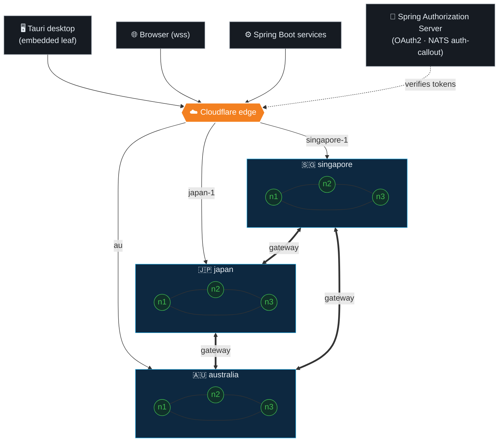

<picture>
  <source media="(prefers-color-scheme: dark)" srcset="./assets/brand/horizontal-inline/dark.svg">
  <source media="(prefers-color-scheme: light)" srcset="./assets/brand/horizontal-inline/light.svg">
  
</picture>

  

> My attempt at building a fast and reliable application with zero-knowledge, end-to-end encrypted chat and industry-specific features.

### Backend

### Messaging

### Frontend

### Desktop

---

### Topology

A NATS supercluster: three regional clusters (3 nodes each, full-mesh routes),
linked region-to-region by gateways, fronted by Cloudflare. Clients reach the
nearest region over WebSocket; the desktop app runs an embedded leaf node.

### Live status

### Organization at a glance

<!-- start organization badges -->
<!-- end organization badges -->

---

Working on: OAuth2/OIDC auth · transactional outbox → JetStream · RFC 8252 native desktop auth · a Rust media pipeline
